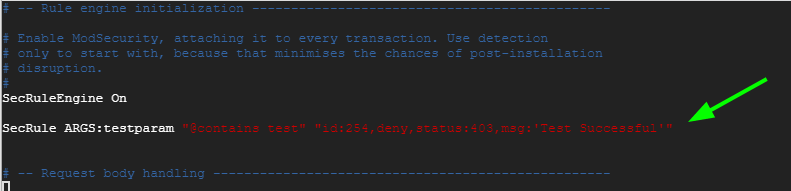

# Cài đặt mô-đun ModSecurity cho Nginx
```
https://www.tecmint.com/install-modsecurity-nginx-debian-ubuntu/
```

## Step 1: Cài đặt các gói phụ thuộc
Cập nhật danh sách gói và làm mới các kho lưu trữ bằng cách.
```
sudo apt update
sudo -i
```
Cài đặt các gói phụ thuộc cần thiết
```
apt install make gcc build-essential autoconf automake libtool libfuzzy-dev ssdeep gettext pkg-config libcurl4-openssl-dev liblua5.3-dev libpcre3 libpcre3-dev libxml2 libxml2-dev libyajl-dev doxygen libcurl4 libgeoip-dev libssl-dev zlib1g-dev libxslt-dev liblmdb-dev libpcre++-dev libgd-dev
```

## Step 2: Cài đặt phiên bản Nginx mới nhất
Để cài đặt phiên bản Nginx mới nhất, ta sẽ thêm một nguồn PPA mới vào hệ thống Ubuntu
```
add-apt-repository ppa:ondrej/nginx-mainline -y
```

Sau đó, cập nhật danh sách gói và cài đặt Nginx
```
sudo apt update
sudo apt install nginx-core nginx-common nginx nginx-full
```

Typically, only the default repository is enabled. It’s prudent to enable the source code repository so that you can, later on, download the Nginx source code in the next step.
To achieve this, modify the Nginx repository file.
```
sudo vim /etc/apt/sources.list.d/ondrej-ubuntu-nginx-mainline-*.list
```
Uncomment this line to enable the source code repository:
```
# deb-src http://ppa.launchpad.net/ondrej/nginx-mainline/ubuntu/ focal main
```
The file should now appear as shown.


Save the changes and exit.
Then update the package index.
```
sudo apt update
```

## Step 3: Tải mã nguồn Nginx
Để biên dịch mô-đun ModSecurity, ta cần tải mã nguồn của Nginx. To do this, we will, first, create an Nginx directory in the ```/usr/local/src/``` path to accommodate the Nginx source code package file.
```
sudo mkdir -p /usr/local/src/nginx 
```
Thereafter, navigate into the Nginx source directory:
```
cd /usr/local/src/nginx 
```
Proceed and download the Nginx source file packages:
```
sudo apt source nginx
```


You can have a peek at the source file using the ls command.
```
ls -l
```


Be sure that the source code version coincides with the version of Nginx installed.
```
nginx -v
```


## Step 4: Cài đặt thư viện Libmodsecurity3

Install it from a source which is preferable since it provides you with the latest version. To start the installation of Libmodsecurity from the source, clone the git repository as shown:
```
git clone --depth 1 -b v3/master --single-branch https://github.com/SpiderLabs/ModSecurity /usr/local/src/ModSecurity/
```
Navigate into the cloned directory:
```
cd /usr/local/src/ModSecurity/
```
Make a point to install the submodules
```
sudo git submodule init
sudo git submodule update
```


Afterward, build the environment using the commands below.
```
sudo ./build.sh 
sudo ./configure
```

Once again, ignore the error displayed below.
```
fatal: No names found, cannot describe anything.
```

Then compile the source code and install other utilities using the following make command. This takes around `25 minutes`, and some patience is required.
```
sudo make -j4
```

Once completed, install the libraries.
```
make install
```

## Step 5: Tải và biên dịch ModSecurity v3 Nginx Connector
ModSecurity Nginx là cầu nối giữa thư viện Libmodsecurity và Nginx. The connector, as the name suggests, links the Libmodsecurity library to the Nginx webserver. To download the Modsecurity connector, Clone it from the GitHub repository as follows.
```
git clone --depth 1 https://github.com/SpiderLabs/ModSecurity-nginx.git /usr/local/src/ModSecurity-nginx/
```

Navigate into the cloned directory.
```
cd /usr/local/src/nginx/nginx-1.27.1/
```

Proceed and install build dependencies
```
apt build-dep nginx
apt install uuid-dev
```

Next, compile the ModSecurity Nginx Connector module with the `--with-compat` flag. The `--with-compat` option makes the ModSecurity Nginx Connector module binary-compatible with the current Nginx library.
```
./configure --with-compat --add-dynamic-module=/usr/local/src/ModSecurity-nginx
```

Once that is done, build the ModSecurity Nginx Connector module using the make command.
```
make modules
```

The module is saved as `objs/ngx_http_modsecurity_module.so`. You need to copy this module to the `/usr/share/nginx/modules/` directory as follows.
```
cp objs/ngx_http_modsecurity_module.so /usr/share/nginx/modules/
```

## Step 6:  Tải và kích hoạt mô-đun ModSecurity Nginx Connector
To load the Nginx connector module, First, access the main Nginx configuration file.
```
vim /etc/nginx/nginx.conf
```

Append the following line just below the first few lines
```
load_module modules/ngx_http_modsecurity_module.so;
```

In addition, append the following lines in the http {...} section. This enables ModSecurity for all Nginx virtual hosts.
```
modsecurity on;
modsecurity_rules_file /etc/nginx/modsec/main.conf;
```


Save the changes and exit the file.

Next up, create the /etc/nginx/modsec/ directory which will store ModSecurity configuration.
```
mkdir /etc/nginx/modsec/
```
Next, copy the ModSecurity configuration file as follows.
```
cp /usr/local/src/ModSecurity/modsecurity.conf-recommended /etc/nginx/modsec/modsecurity.conf
```

Then open the configuration file.
```
vim /etc/nginx/modsec/modsecurity.conf
```

Locate the line beginning with the SecRuleEngine directive.
```
SecRuleEngine DetectionOnly
```

This line instructs ModSecurity to only log HTTP transactions but takes no action in the face of a web app attack. You need to change this so that Modsecurity will not only detect but also block web attacks.

Change the line to the line below
```
SecRuleEngine On
```


Save the changes and exit the file.
Next, create the /etc/nginx/modsec/main.conf file.
```
vim  /etc/nginx/modsec/main.conf
```

Append this line to reference the `/etc/nginx/modsec/modsecurity.conf` configuration file.
```
Include /etc/nginx/modsec/modsecurity.conf
```

Save the changes and exit the file.
Additionally, copy the Unicode mapping file.
```
cp /usr/local/src/ModSecurity/unicode.mapping /etc/nginx/modsec/
```

### nginx-1.19.0 is broken: undefined symbol: ngx_stream_add_variable
Got me most of the way there, but there is a slight mistake on the ln line. This worked for me:
```
cd /etc/nginx/modules-enabled/
ln -s /usr/share/nginx/modules-available/mod-stream.conf 50-mod-stream.conf
dpkg --configure -a
systemctl start nginx
```

Then test Nginx configuration.
```
nginx -t
```


The test should be successful. If not, head back and check if all the changes made are correct.
Then finally, restart Nginx to apply all the changes made.
```
systemctl restart nginx
```

And verify that Nginx is running as expected.
```
systemctl status nginx
```

## Step 7: Tải và cấu hình bộ quy tắc OWASP Core Rule Set
For ModSecurity to protect your web applications, you need to specify rules that are going to detect suspicious activities and block them. To get started, it’s preferable to install existing rule sets that will help you learn the ropes.

The OWASP Core Rule Set (CRS) is a free, open-source, and community-maintained rule set that provides rules to ward off common attack vectors such as SQL injection, Cross-site scripting (XSS). Bộ quy tắc OWASP Core Rule Set (CRS) giúp bảo vệ ứng dụng web khỏi các cuộc tấn công phổ biến

Download the OWASP Core Rule Set from Github as shown using the wget command.
```
wget https://github.com/coreruleset/coreruleset/archive/refs/tags/v4.5.0.tar.gz
```

Extract the compressed file.
```
tar xvf v4.5.0.tar.gz
```

Ensure to move the uncompressed directory to the /etc/nginx/modsec/ path.
```
mv coreruleset-4.5.0/ /etc/nginx/modsec/
```
Then rename the crs-setup.conf.example file to crs-setup.conf.
```
mv /etc/nginx/modsec/coreruleset-4.5.0/crs-setup.conf.example /etc/nginx/modsec/coreruleset-4.5.0/crs-setup.conf
```

Again, head back to the ModSecurity configuration file.
```
vim /etc/nginx/modsec/main.conf
```

And append the following lines.
```
Include /etc/nginx/modsec/coreruleset-4.5.0/crs-setup.conf
Include /etc/nginx/modsec/coreruleset-4.5.0/rules/*.conf
```

The file should now have 3 lines:


Save the file and, once again, restart Nginx.
```
systemctl restart nginx
```

## Step 8: Kiểm tra ModSecurity
Finally, We are going to carry out a test ModSecurity and confirm it can detect and block suspicious HTTP traffic.

We are going to edit the ModSecurity configuration file and create a blocking rule that will block access to a certain URL when accessed by a web browser.
```
vim /etc/nginx/modsec/modsecurity.conf
```

Add this line just below the SecRuleEngine On directive
```
SecRule ARGS:testparam "@contains test" "id:254,deny,status:403,msg:'Test Successful'"
```
You can set the `id` and `msg` tags to your preferred values.


Save the changes and restart Nginx.
```
systemctl restart nginx
```

Now launch your browser and visit the URL below with the ?testparam=test suffix
```
http://server-ip/?testparam=test
```

You should get a 403 ‘Forbidden’ error. This indicates that you are trying to access a forbidden resource on the webserver.

Additionally, you can check the Nginx error logs to confirm that the client was blocked
```
tail -f /var/log/nginx/error.log | grep "Test Successful"
```


# Uninstall
```
sudo apt-get remove --purge nginx nginx-common nginx-core nginx-full
sudo apt-get autoremove
 sudo apt-get autoclean
sudo add-apt-repository --remove ppa:ondrej/nginx
apt purge nginx* libnginx*
rm -rf /etc/nginx
mv "/etc/apt/sources.list.d/nginx.list" "/etc/apt/sources.list.d/.nginx.list"
 sudo apt install nginx-core nginx-common nginx nginx-full
```